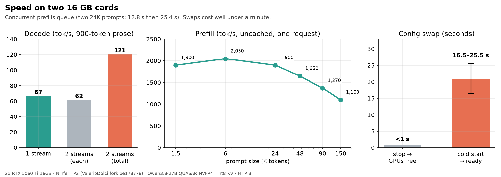
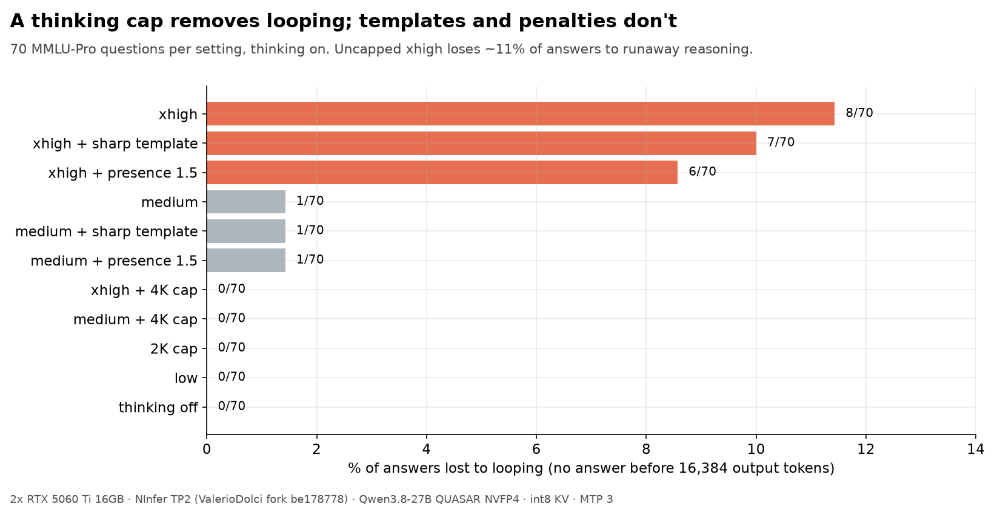
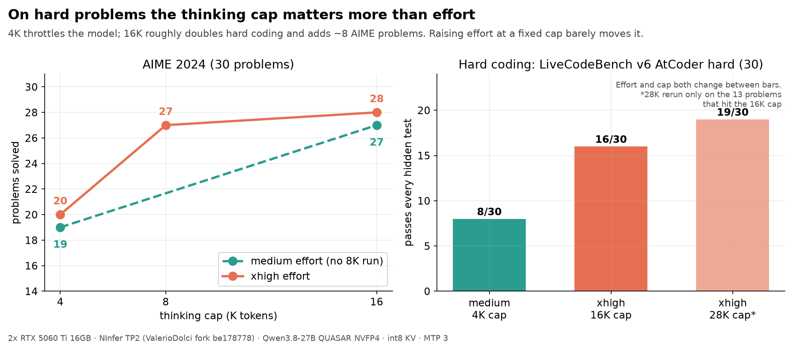
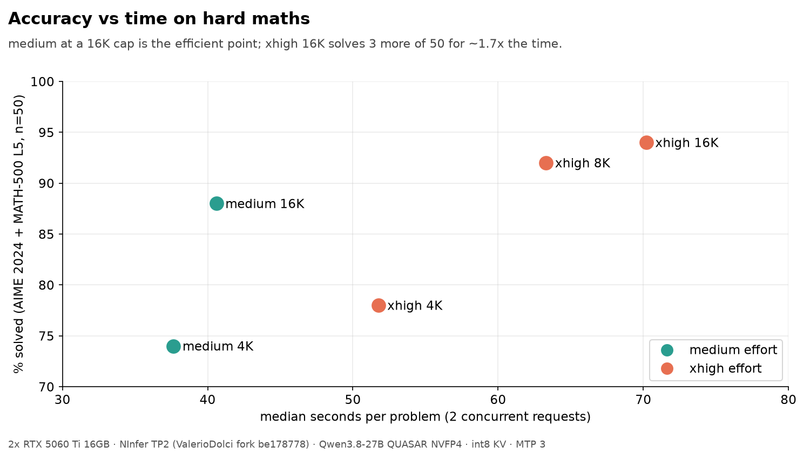
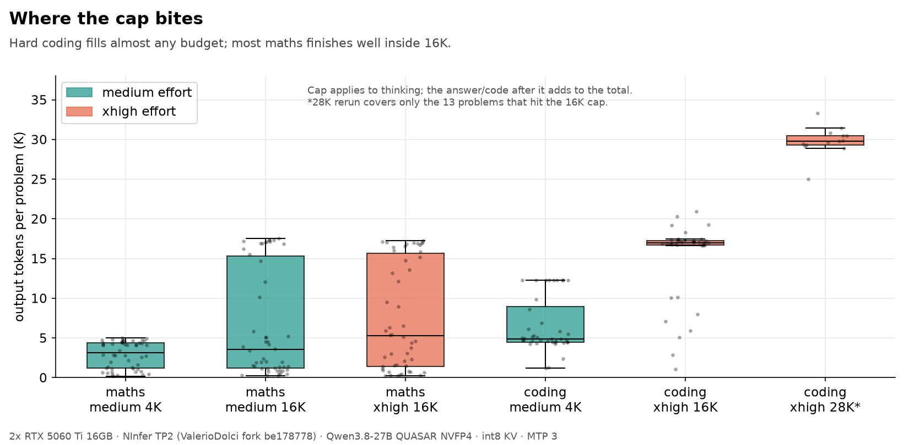

# NInfer TP2: Qwen3.8 27B NVFP4 on 2x RTX 5060 Ti

NInfer is a CUDA engine built for one RTX 5090. The community TP2 forks split it across two cards, which makes it the fastest route we have measured for Qwen3.8 27B on a pair of 16 GB 5060 Tis. This page covers the serving config, speed, fit, and a set of reasoning-effort and thinking-cap experiments run on 2026-10-08.

All numbers come from one machine. Treat them as a starting point, not a guarantee.

## Setup

- 2x RTX 5060 Ti 16GB, each on PCIe Gen3 x8, no P2P (the fork's pinned-host mailbox all-reduce handles this), driver 595.58.03, CUDA 13.2, power limits 170/180 W.
- Engine: [ValerioDolci/ninfer-tp2](https://github.com/ValerioDolci/ninfer-tp2) at `be178778` (v0.4.7+1).
- Weights: [Feyd89/Qwen3.8-27B-QUASAR-QAT-nvfp4-NInfer](https://huggingface.co/Feyd89/Qwen3.8-27B-QUASAR-QAT-nvfp4-NInfer), about 8.7 GiB per rank.
- Preset: `ninfer-tp2-qwen38-27b-quasar-2x5060ti` (alternative). Evidence: [`data/evidence/ninfer-tp2-qwen38-27b-quasar-2x5060ti-262k.json`](../data/evidence/ninfer-tp2-qwen38-27b-quasar-2x5060ti-262k.json).
- Launcher: [`examples/ninfer-tp2-qwen38-27b.sh`](../examples/ninfer-tp2-qwen38-27b.sh). int8 KV, MTP with 3 draft tokens, vision on, 262,144 context, 2 concurrent requests, 8 device state slots, 16K default thinking cap.

### Why QUASAR rather than the official NVFP4

The QUASAR model card compares it directly against the official NVFP4 weights: MMLU-Pro 1.0 point lower (p = 0.65), IFEval identical, GSM8K 0.5 higher, 126K recall identical. None of those differences are significant. QUASAR is about 2 GiB smaller per card and faster (the official build's decode is 9 to 18% slower in NInfer's own tables), so on 16 GB cards it leaves more room for context. We did not rerun that comparison ourselves.

## Speed

| Metric | Result |
| --- | ---: |
| Decode, 1 stream (900-token prose, thinking off) | 67 tok/s |
| Decode, 2 streams | 62 tok/s each, 121 total |
| TTFT, short prompt | 0.06 s |
| Prefill, uncached, 1.5K / 6K / 24K / 48K / 90K / 150K | 1,900 / 2,050 / 1,900 / 1,650 / 1,370 / 1,100 tok/s |
| Two 24K prompts at once | finished at 12.8 s and 25.4 s (prefill is serialised) |
| Two 90K prompts at once | one returned HTTP 503 |
| 64K context, 4 concurrent: decode 1 / 2 / 4 streams | 73 / 67 / 53 tok/s per stream (73 / 134 / 211 total) |
| Stop service, GPUs free | under 1 s |
| Cold start to first response | 16.5 to 25.5 s |

Speed rows above are from the 196K production config except the 64K x 4 row, measured in a separate restart. More concurrency raises total decode throughput (211 tok/s with 4 streams) but not prefill. Prefill already saturates both cards, so a second long prompt waits for the first.

An earlier matched run against vLLM (same QUASAR checkpoint, TP2, MTP 3) found NInfer 31 to 34% faster on decode and about 15% faster on 12.7K prefill, with no measurable quality difference on GSM8K (1,319 items) or MMLU-Pro (420 items).

## Fit

| Config | VRAM per card | Result |
| --- | ---: | --- |
| 196K, vision, 8 state slots, 2 concurrent | 13.4 / 13.0 GB | runs; used for all accuracy tests below |
| 262K, vision, 8 state slots, 2 concurrent, 16K cap | 14.5 / 14.1 GB | starts in 14.5 s; read a chart image correctly; recalled an updated fact at 171K (169 s) and 238K (284 s) prompt tokens |
| 262K, no vision, 4 state slots, 2 concurrent | 13.8 GB | starts in 17 s; recall correct at 171K |
| 64K, 4 concurrent, 262K pooled KV, 8 slots | 14.3 GB | starts in 16 to 25 s; 211 tok/s total decode at 4 streams |

The fork's README says vision plus 8 slots does not fit at 196,608 with MTP3. On these cards with int8 KV it fit at the full 262,144, with about 1.8 GB spare on the vision card. Recall at that length works but costs minutes of prefill.

### High-context profile

The repo's `scripts/run_high_context_profile.py` at 262,144 (uncached, unique nonce per request, 3,072-token sustained budget):

| Run | Retrieval at ~230.8K | Sustained at ~183.6K | Decode | Prefill |
| --- | --- | --- | ---: | ---: |
| Thinking off | 2/2 passed | 2/2 passed, ~7K visible characters each | 63.0 tok/s | 863 tok/s at 230.8K, 986 at 183.6K |
| Thinking on (diagnostic) | 2/2 passed | 1/2 passed; the failed run spent all 3,072 tokens reasoning and returned no visible text | 60.4 tok/s | same |

The published evidence uses the thinking-off run. With thinking on at very long context, the model can exhaust a small output budget before answering. The server's 16K thinking cap does not help when `max_tokens` is below it, so give long-context thinking requests at least 20K output tokens.

The TP2 fork rejects Qwen3.6-35B-A3B (MoE) at startup, and the 21 GB MoE does not fit on a single 16 GB card for single-GPU NInfer. Use llama.cpp or vLLM for that model on this hardware.

## Reasoning effort and thinking caps

Qwen3.8's `reasoning_effort` is not a budget. Each tier adds a system-prompt sentence: `xhigh` (the template default when nothing is sent) asks for careful validation, `medium` adds nothing, `low` asks for brevity. Only a hard cap (`--default-thinking-budget N` server-wide, or `thinking.budget_tokens` per request on the Messages endpoint) actually stops thinking.

Three test sets, thinking on, 2 concurrent requests, run against the live server:

- **MMLU-Pro:** 70 questions (5 per category, fixed seed), 16,384 max output tokens.
- **Hard maths:** all 30 AIME 2024 problems plus 20 integer-answer MATH-500 level-5 problems.
- **Hard coding:** 40 LiveCodeBench v6 AtCoder problems from January to March 2025 (30 hard, 10 medium). A problem only counts if the program passes every hidden test (usually 30 to 40) within 6 s each, run in a network-less container.

### Caps fix looping

Uncapped `xhigh` lost 8 of 70 answers to reasoning that looped until the 16K output limit, with no answer. Any cap brought that to zero. A presence penalty of 1.5 (6/70) and the community `qwen-sharp` template v22.5.2 (7/70) barely helped.

MMLU-Pro accuracy landed between 70% and 80% for every setting, which is within noise at 70 questions. More thinking does not help knowledge recall.

### On hard problems, the cap matters more than effort

| Setting | AIME 2024 | MATH-500 L5 | Hard coding | Median s/problem (maths) |
| --- | ---: | ---: | ---: | ---: |
| medium, 4K cap | 19/30 | 18/20 | 8/30 | 38 |
| xhigh, 4K cap | 20/30 | 19/20 | n/a | 52 |
| xhigh, 8K cap | 27/30 | 19/20 | n/a | 63 |
| medium, 16K cap | 27/30 | 17/20 | n/a | 41 |
| xhigh, 16K cap | 28/30 | 19/20 | 16/30 | 70 |
| xhigh, 28K cap | n/a | n/a | 19/30\* | n/a |

\*The 28K run reran only the 13 hard coding problems that hit the 16K cap; 3 of them then passed, at a median of 7.4 minutes each. Medium coding problems: 9/10 at medium 4K, 10/10 at xhigh 16K.

A 4K cap throttles hard reasoning. At 16K, effort level changes the result by a problem or two, while xhigh takes about 1.7 times as long. Most maths finishes well inside 16K. Hard coding uses whatever budget it gets.

## Recommendation

- Set `--default-thinking-budget 16384` server-wide. It removes looping and keeps nearly all of the gain on hard problems.
- Send `reasoning_effort: "medium"` for everyday requests. Many clients send nothing, which gets the template default `xhigh`.
- Reserve `xhigh` with a 16K to 28K per-request cap for hard coding or maths where minutes per answer is acceptable.
- Keep the stock chat template. The `qwen-sharp` template's gain at medium (77.1% vs 74.3% MMLU-Pro) is within noise and it did not fix xhigh looping.

## Caveats

- Single machine, one run per setting, modest sample sizes. Differences of a few problems are noise.
- Benchmarks ran with 2 concurrent requests on a live server, so per-problem times include some queueing.
- The accuracy runs used per-request caps. The server-wide `--default-thinking-budget` was checked separately: with a 1,024 default and no per-request settings, a hard AIME problem stopped thinking and still produced an answer (1,526 output tokens). Accuracy under the server default was not rerun.
- Algorithmic problems are not repository work. These tests say nothing about multi-file edits or agent loops.
